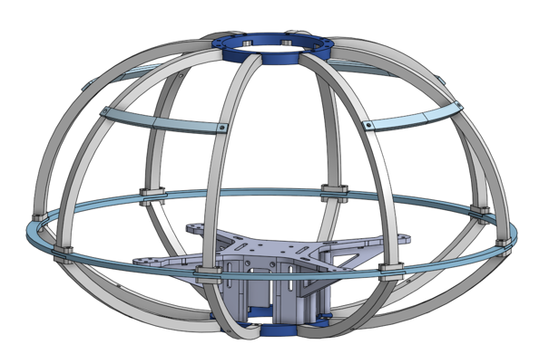
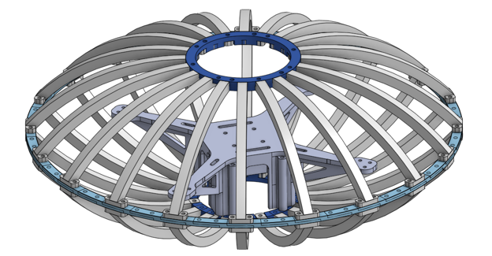
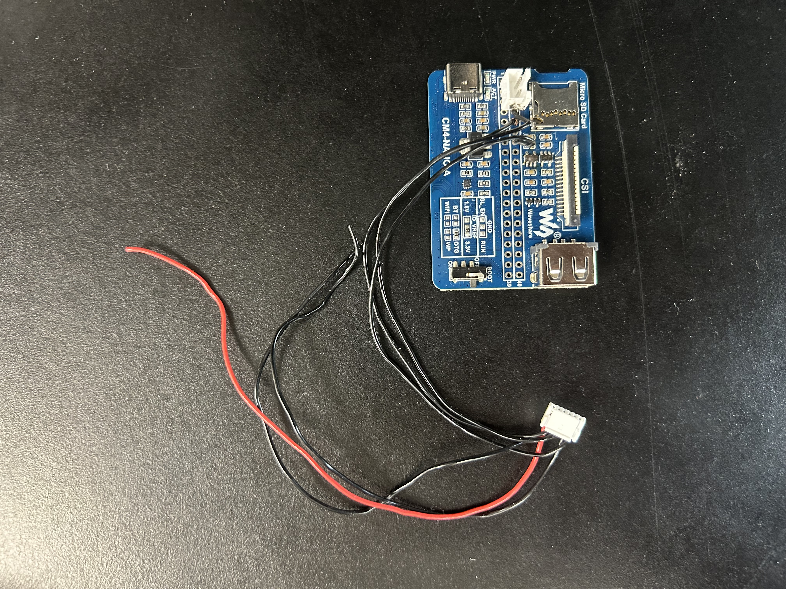
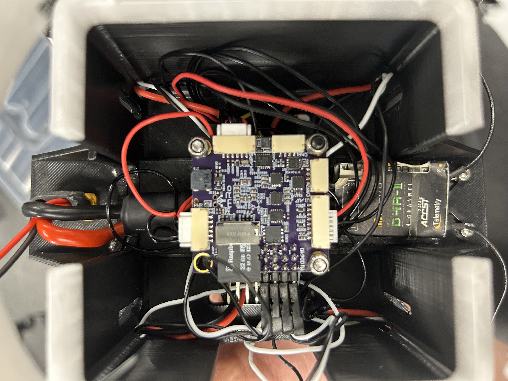
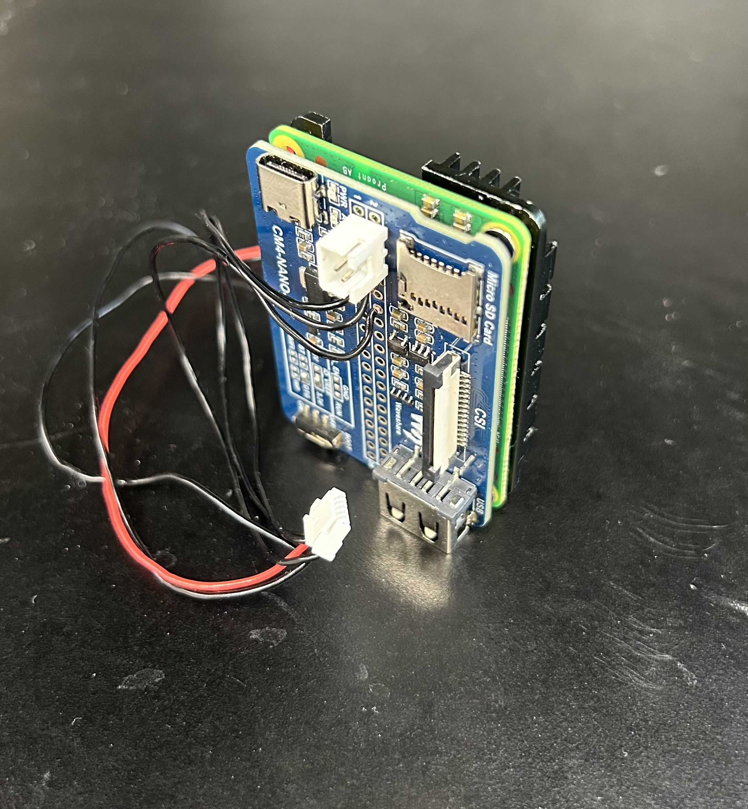
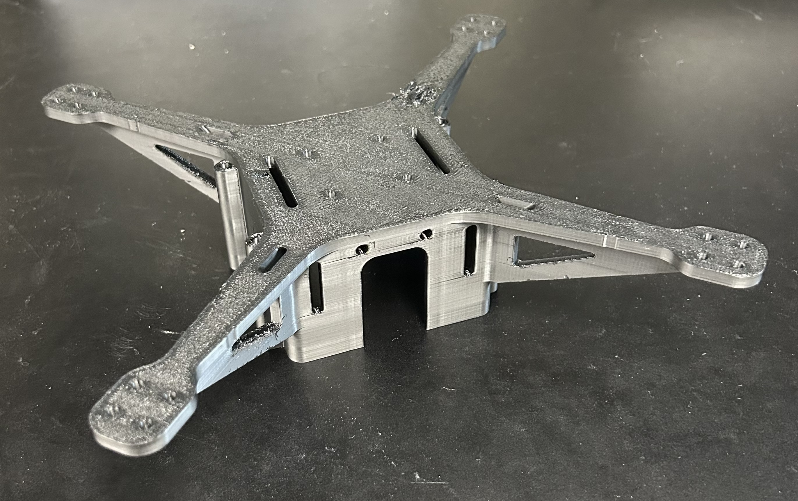
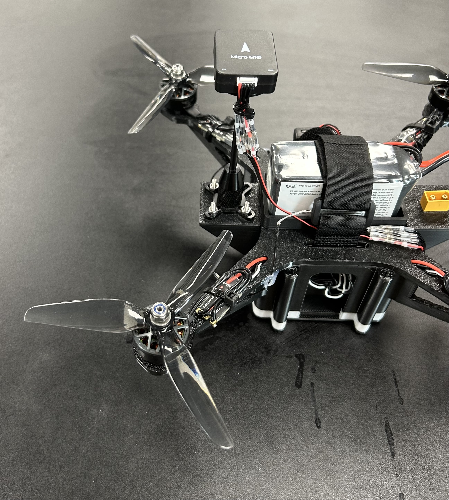
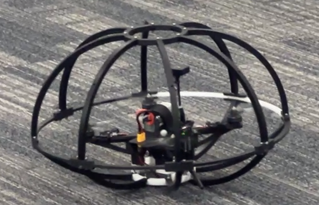

## Parts and Materials

| Component          | Part                       |
| :----------------- | :------------------------- |
| Flight controller  | Pixracer Pro               |
| Companion Computer | Raspberry Pi 4 (CM4)       |
| Battery            | 4s Lipo Battery            |
| Power Module       | PM06 V2 Power Module       |
| UBEC               | 3A 5V/12V Step Down        |
| ESCs               | 20A ESC Brushless          |
| Motors             | AE2207 V2 1860KV           |
| Propellors         | Ethix S5 FPV Propellers    |
| Receiver           | RadioMaster Nano Receiver  |
| GPS                | Micro M10 GPS              |

<iframe src="https://docs.google.com/spreadsheets/d/e/2PACX-1vSRq0tHDbg0IG0rRhlybVfgOTkBPtudFkbCOZAE0m4iuqi01SQipHfZlnBKwyBWJ7AOTi9DX4quLazz/pubhtml?widget=true&amp;headers=false" width="100%" height=500></iframe>

*Go to the detailed* [*spreadsheet*](https://docs.google.com/spreadsheets/d/1LUWi4ggH35qG4yhqyKMxsZWXXt1vWTmcn4yWivKcUjc/edit?gid=2018888461#gid=2018888461)

## Spherical Protection Cage

/// caption
Quadrotor protection cage
///

/// caption
Parametric structure of the cage
///

View the [CAD files](https://cad.onshape.com/documents/bf80332605a7d984d935375e/w/24ac1fcd083dd13b2356253e/e/7d5c19421e912783dd7f62f7?renderMode=0&uiState=684a40f18527db19e65773b8) in Onshape

## Parts

/// caption
Nano connection board for RPi
///

/// caption
Pixrace Pro flight controller
///

/// caption 
RPi IO board
///

/// caption
Assembled RPi with the nano board and heatsink
///

/// caption
3D printed quadrotor frame
///

/// caption
Fully assembled quadrotor
///

/// caption
Quadrotor with the protection cage
///