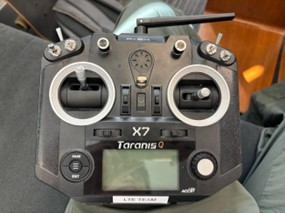
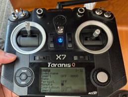
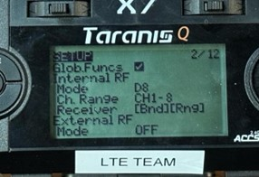
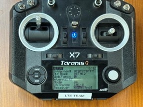
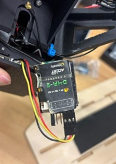

# Binding the Quadrotor to the Taranis Q X7 Transmitter

!!! Tip "Quick Check"
    If it is already binded, no need to do it again (check **Step 6**)

## 1. Open the Radio Setup menu

{ width="100%" }
/// caption
Figure 1
///

* Press the left-hand button marked with three horizontal lines (see *Figure 1*)
* The screen should now display the main **MODLESEL** page

## 2. Navigate to Model Setup

{ width="100%" }
/// caption
Figure 2
///

* Once you reach the **MODLESEL** page, select the model you want to enter in and press **PAGE** to reach the page labeled **SETUP** (see *Figure 2*)

!!! Info "Preset Pofile"
    For right now, just go to model Lee and bind it to the quadcopter

## 3. Verify Internal RF parameters

{ width="100%" }
/// caption
Figure 3
///

* Scroll all the way down to the **Internal RF**: Mode, Channel Range, Receiver, and External RF setting. (see *Figure 3*)
* Inside the **Internal RF** section confirm the following:

    | **Setting** | **Required Value** |
    |:-----|:----|
    | Mode | ON |
    | Channel Range | CH 1 – 8 |
    | Receiver | [Bind][Rngh] |  
    | External RF | OFF |

## 4. Bind the receiver

{ width="100%" }
/// caption
Figure 4
///

* Highlight **Bind** and long-press **ENT**
* The radio will beep and display **Binding…**
* At the same time, if the quadcopter is powered on, it will also beep.

## 5. Bind the quadcopter receiver to the Transmitter

{ width="100%" }
/// caption
Figure 5
///

!!! Info
    If the receiver’s antenna falls off, don’t worry—it happens often. Just plug it back in.

* **Disconnect power** – unplug the quadcopter battery.
* **Enter bind mode on the receiver**
    * Locate the small bind button on the upper-left corner of the receiver (see *Figure 5*)
    * Hold this button and reconnect the battery, then release it once the LED on the receiver starts **flashing green**
* **Complete the bind on the radio**
    * On the transmitter, highlight Bind and press **ENT**
    * When the receiver LED turns **solid green**, the link is established
    * Press **ENT** on the transmitter to leave bind mode

## 6. Confirm a successful bind 

* Power-cycle both the transmitter and the quadcopter
* On power-up you should notice:
    * The transmitter gives a single, clear beep
    * The receiver LED lights solid green

!!! Success "One-time Setup"
    After a successful bind, the link is stored in memory—each time you power on the transmitter and quadcopter they will reconnect automatically, unless the receiver is re‑bound to another radio.
