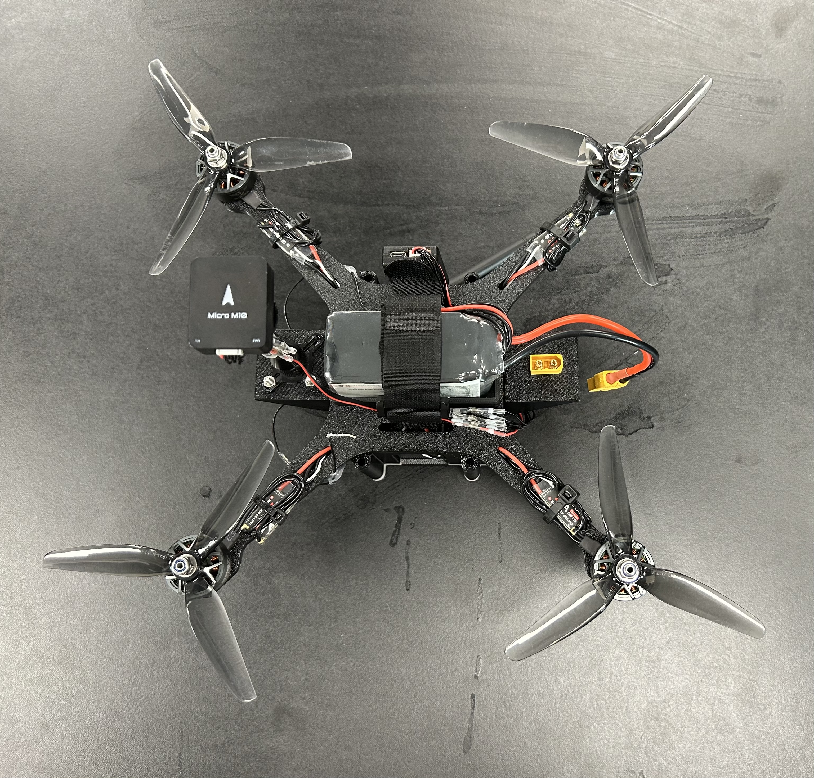

---
hide:
  - navigation
---

#  Multi-Agent Quadrotor Control with ROS 2

## Project Objective

Create a ready-to-fly, LLM-enabled **drone swarm** with high customizability to provide a platform for **multi-agent coordination** and **AI agent** research within the **MAGICC Lab**

!!! Abstract "Overview"
    This project accomplishes this in three ways:

    - Custom built quadrotor
    - Multi-agent coordination simulations
    - AI agent integration

## Custom Quadrotor

{ width="50%" }
/// caption
Fully assembled quadrotor
///

/// caption
Spherical protection cage
///

## Multi-Agent Coordination

/// caption
Keyboard input commands
///

/// caption
Waypoint following
///

## AI Agent Integration

/// caption
Drone Control Agent
///

/// caption
Natural language command processing
///