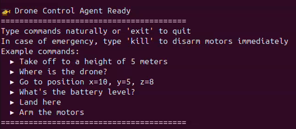
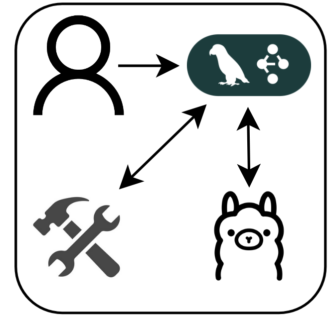
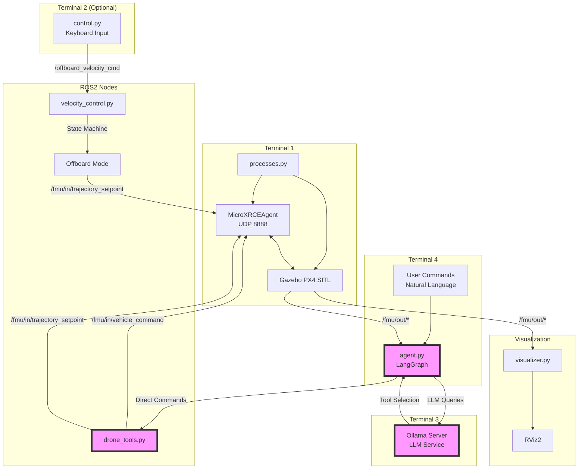

# LangGraph Agents

This page explains what LangGraph is and how to use the drone control agent located in the ROS2 package called `ai_agent`.

## Learn LangGraph

For a full tutorial, use the [Introduction to LangGraph](https://academy.langchain.com/courses/intro-to-langgraph) created by LangChain Academy

## Drone Control Agent


/// caption
Drone control agent
///

{width="50%"}
///caption
General process of the AI agent
///

Natural language commands are proccessed by the LangGraph agent by invoking LLM calls to the Ollama model. The agent is directed to which ROS2 tool call is needed to correctly control the quadrotor.

| Name | Purpose |
| :--- | :------------------------- |
| User | Represents natural language commands from a user. |
| [LangGraph](https://python.langchain.com/docs/langgraph/) | A library for building stateful, multi-actor applications with LLMs, used here as the framework for the AI agent. |
| [Tools](https://github.com/austin006/3d_printed_quad/blob/main/src/ai_agent/ai_agent/drone_tools.py) | A list of ROS2 tools provided to the AI agent to control the quadrotor. |
| [Ollama](https://ollama.com/) | A tool for running large language models (LLMs) locally. |

## Architecture Overview

The agent is designed to work alongside the existing PX4 simulation infrastructure:



## `ai_agent`

In this package, the `px4_offboard` simulation is expanded to interface with an AI Agent allowing for natural language interaction with the quadrotor. This is implented with ROS2, LangChain, LangGraph, and Ollama.

### Set-up

1. First make sure you have [downloaded ollama](./ollama.md) and pulled the model you wish to use

2. Create a python virtual environment for the required dependencies
    ```
    # Navigate to your ai_agent package
    cd src/ai_agent

    # Create a virtual environment
    python3 -m venv venv

    # Activate it
    source venv/bin/activate

    # Install dependencies
    pip install langgraph langgraph-prebuilt langchain-core  langchain_ollama
    ```

### Instructions to run the agent

To run the agent as a python file (without ROS2) paste the following commands in a terminal (adjust the file paths as needed)

```
cd /ros2_workspaces/3d_printed_quad/src/ai_agent 
source venv/bin/activate 
source ~/ros2_workspaces/3d_printed_quad/install/setup.bash 
export PYTHONPATH=$PYTHONPATH:/ros2_workspaces/3d_printed_quad/src/ai_agent 
python3 ai_agent/agent.py 
```

To run the agent with the launch files, build the ROS2 workspace and source the environment

```
colcon build
source install/setup.bash
```

Then you can start the launch file of your choice

```
ros2 launch ai_agent <package_name>
```

| Launch File | Description |
| :--- | :--- |
| `test_agent.launch.py` | Launch only the drone control agent |
| `offboard_agent_control.launch.py` | Launch the drone control agent with a Gazebo simulation |