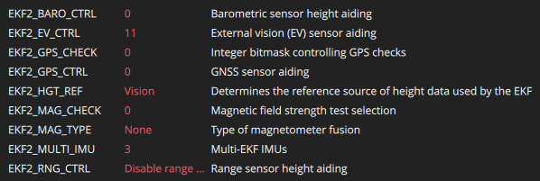

# Quadrotor Flight with ROS2 and PX4 - Guide

This page describes how to fly a quadrotor using a motion capture (MOCAP) system. Instructions on how to fly a quadrotor using PX4 in offboard mode through QGroundControl and ROS2.

## MOCAP Set-up

Basic overview:

1. Create an asset
2. Track and publish data via VRPN
3. Start VRPN client node
4. Subscribe to data on ROS2 topic

### Create an Asset

See [Leon's Tutorial](https://www.notion.so/MOCAP-Room-24cdc719863380bbb0e2c94d5b7d8ec7) for a detailed walk-through.

### Publish MOCAP Data

See [Leon's Tutorial](https://www.notion.so/MOCAP-Room-24cdc719863380bbb0e2c94d5b7d8ec7) for a detailed walk-through.

Note that you only need to enable the VRPN option. NatNet streaming enabled is not required.

### Receive MOCAP Data

See [Leon's Tutorial](https://www.notion.so/MOCAP-Room-24cdc719863380bbb0e2c94d5b7d8ec7) for a detailed walk-through.

The data of the asset (position and quaternion) will be published to a ROS2 topic.

Install vrpn-mocap package
```bash
sudo apt install ros-<rosdistro>-vrpn-mocap
```

Run the mocap node. The server number is something like `192.168.1.191`
```bash
ros2 launch vrpn_mocap client.launch.yaml server:=<server number> port:=3883
# Or try this
ros2 run vrpn_client_ros vrpn_client_node 
```

Check mocap data being published. **You must be connected to MAGICC wifi!**
```bash
ros2 topic echo /vrpn_mocap/<asset_name>/pose
```

Check frequency of messages
```bash
ros2 topic hz /vrpn_mocap/<asset_name>/pose
```

### Resources

- [Leon's Tutorial](https://www.notion.so/MOCAP-Room-24cdc719863380bbb0e2c94d5b7d8ec7)
- [MAGICC Lab Tutorial](https://magicc.byu.edu/wiki/ros2_tutorials/mocap/mocap_tutorial/#data-collecting-with-ros)
- [VRPN Documentation](https://index.ros.org/r/vrpn_mocap/#jazzy)

## PX4 Offboard Mode

To fly autonomously via ROS2 commands, the vehicle must be in offboard mode. This requires configuration of PX4 parameters as described below as well as a constant proof of life signal being published from the ROS2 controller program.

### PX4 Parameters

- `EKF2_BARO_CTRL`: 0
- `EKF2_EV_CTRL`: 11
- `EKF2_GPS_CHECK`: 0
- `EKF2_GPS_CTRL`: 0
- `EKF2_EV_DELAY`: 0.0ms
- `EKF2_HGT_REF`: Vision
- `EKF2_MAG_CHECK`: 0
- `EKF2_MAG_TYPE`: None
- `EKF2_MULTI_IMU`: 3
- `EKF2_RNG_CTRL`: Disable range fusion 

{ width="100%" }
/// caption
Parameters set using QGroundControl
///

#### Resources

- PX4 Guide - [EKF2 Tuning/Configuration](https://docs.px4.io/main/en/ros/external_position_estimation#ekf2-tuning-configuration)
- AREAL Hardware Standup Guide - [PX4 Parameters for VICON Camera Feedback](https://areal-gt.github.io/documentation/_build/Hardware%20Standup%20Guide/hardware_su.html#px4-parameters-for-vicon-camera-feedback)
- Github issue - [Vicon Position Tracking w/ ROS2](https://github.com/PX4/PX4-Autopilot/issues/21232)
- Github issue - [Flying in position mode with Optitrack motion capture is unstable](https://github.com/PX4/PX4-Autopilot/issues/21468)

## Helpful Commands for Debugging

### Quick Reference

Start VRPN Client
```bash
ros2 launch vrpn_mocap client.launch.yaml server:=192.168.1.201 port:=3883
```

Login to Jetson
```bash
ssh magicc@ubuntu.local
```

Launch QGC
```bash
./Downloads/QGroundControl-x86_64.AppImage 
```

Clone `px4_msgs` package
```bash
git clone https://github.com/PX4/px4_msgs.git
```

### ROS2 Commands

Check the published mocap data
```bash
ros2 topic echo /vrpn_mocap/x650_quad/pose
ros2 topic hz /vrpn_mocap/x650_quad/pose
```

Check the position data passed to PX4
```bash
ros2 topic echo /fmu/in/vehicle_visual_odometry
ros2 topic hz /fmu/in/vehicle_visual_odometry
```

Check odometry data published by EKF2
```bash
ros2 topic echo /fmu/out/vehicle_odometry
ros2 topic hz /fmu/out/vehicle_odometry
```

Rebuild the `mocap_px4_bridge` package
```bash
colcon build --packages-select mocap_px4_bridge
source install/setup.bash 
ros2 run mocap_px4_bridge mocap_px4_bridge
```

Playback saved mocap data from a rosbag
```bash
ros2 bag play mocap_data/
```

### PX4 Console Debugging 

This is in the MAVLink Console
```bash
# Check flight status
commander status
# See the recent data received on any PX4 topic
listener vehicle_visual_odometry
listener vehicle_status
listener vehicle_odometry
listener estimator_status
listener vehicle_local_position
# Manage ekf2 
ekf2 stop
ekf2 start
ekf2 status
# Check PX4's internal time
uorb top -1 vehicle_visual_odometry
# Other checks
listener estimator_innovations
listener estimator_innovation_variances
listener estimator_status_flags
listener sensor_combined
commander check
```