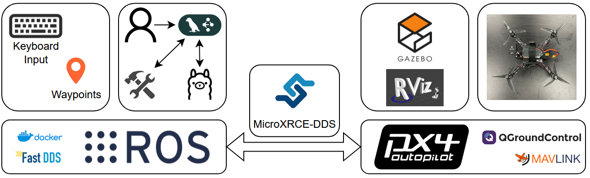
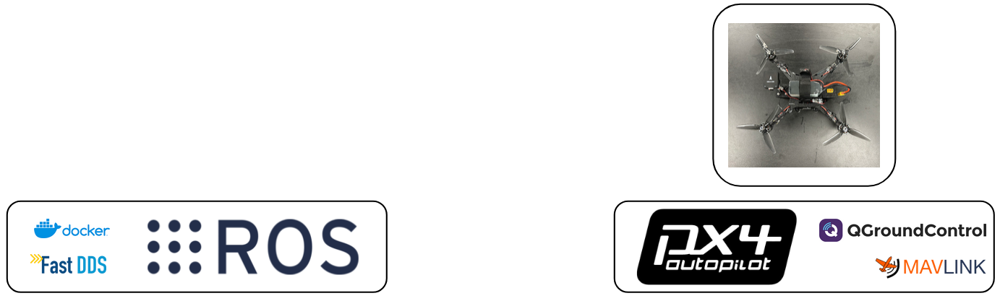
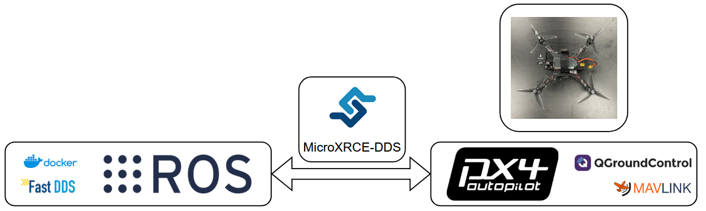
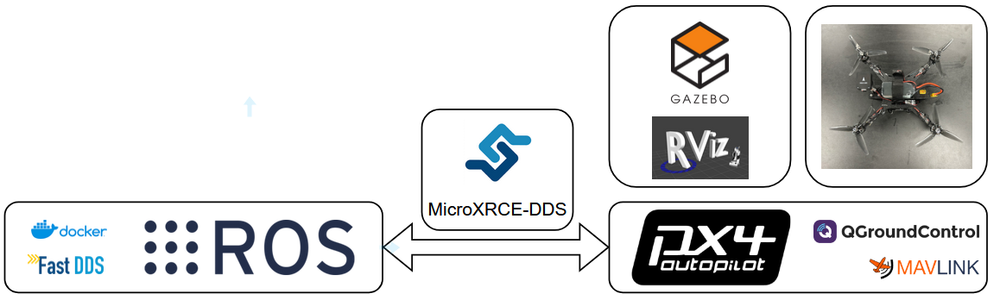

# Software Overview

## Full Set-up

/// caption
Layout of the whole software system
///

| Name | Purpose |
| :--- | :------------------------- |
| [Docker](https://www.docker.com/) | A platform for developing, shipping, and running applications in containers. |
| [Fast DDS](https://fast-dds.docs.eprosima.com/en/latest/) | A high-performance, open-source C++ implementation of the Data Distribution Service (DDS) standard, serving as the default middleware for ROS2. |
| [Gazebo](https://gazebosim.org/) | A powerful 3D robotics simulator that allows for the simulation of robots in complex indoor and outdoor environments. |
| Keyboard Input | A ROS2 node that accepts keyboard input commands and converts them into quadrotor flight commands. |
| [LangGraph](https://python.langchain.com/docs/langgraph/) | A library for building stateful, multi-actor applications with LLMs, used here as the framework for the AI agent. |
| [MavLink](https://mavlink.io/en/) | A lightweight messaging protocol for communicating with small unmanned vehicles. |
| [MicroXRCE-DDS](https://micro-xrce-dds.docs.eprosima.com/en/latest/) | A client-server protocol that enables resource-constrained devices (microcontrollers) to communicate with a DDS network. |
| [Ollama](https://ollama.com/) | A tool for running large language models (LLMs) locally. |
| [PX4](https://px4.io/) | An open-source flight control software for drones and other unmanned vehicles. |
| [QGroundControl](http://qgroundcontrol.com/) | An open-source ground control station (GCS) for MAVLink-based drones, providing flight control and mission planning. |
| Quadrotor | The physical unmanned aerial vehicle (UAV) with four rotors. |
| [ROS2](https://docs.ros.org/) | Robot Operating System 2, a set of software libraries and tools for building robot applications. |
| [RViz](https://wiki.ros.org/rviz) | A 3D visualization tool for ROS that displays sensor data, robot models, and algorithm outputs. |
| Tools | A list of ROS2 tools provided to the AI agent to control the quadrotor. |
| User | Represents natural language commands from a user. |
| Waypoints | A ROS2 node that converts a provided list of waypoints to a trajectory path for a quadrotor flight. |

## Fitting in the Software

Follow along with the diagrams step by step to see how each piece builds upon the previous. This will allow for a natural, intuitive understanding if you are not familiar with many of the tools presented.

### Transmitter

/// caption
Connection between transmitter, PX4, and quadrotor
///

### ROS 2

/// caption
ROS 2 is an open-source framework designed to simplify the development of robotics software
///

### MicroXRCE-DDS

/// caption
MicroXRCE-DDS creates a communication bridge between ROS2 and PX4
///

### Gazebo

/// caption
Gazebo and RViz are used to simulate quadrotor flight
///

### Advanced Control

/// caption
ROS 2 provides framework to perform complex tasks and customize quadrotor control
///

### AI Agent

/// caption
An AI Agent can invoke LLMs and call tools to process natural language flight commands
///