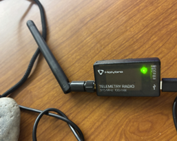
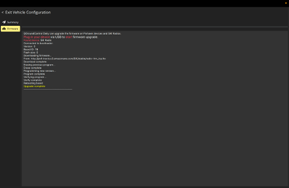
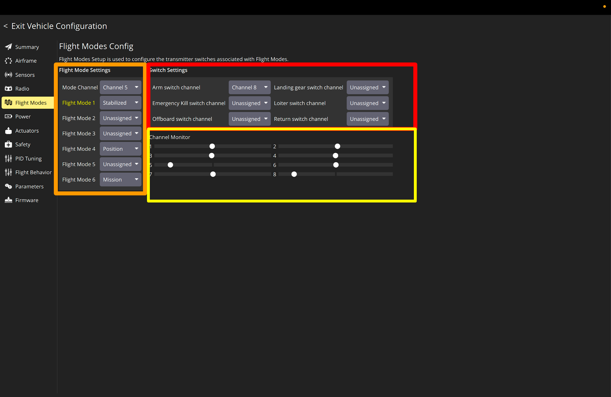

Follow these steps once the quadcopter is assembled and ready to fly.

## 1. Update firmware

* Update the framework when using the **Holybro Telemetry Radio Modules**

/// caption
Holybro Telemetry Radio Module
///

* Always flash the same firmware to both telemetry radios (air‑side and ground‑side) to ensure they communicate properly (**make sure both of them have the same frequency**)
* In QGroundControl, open **Vehicle Setup –▸ Firmware**, select each radio in turn, and click "Update"
* Once updated, the radio link lets you monitor Pixhawk data wirelessly—no USB cable required

/// caption
QGroundControl homescreen
///

/// caption
Firemware page
///

## 2. Sensors

Click on compass and perform the callibration of the flight controller.

## 3. Radio

Callibrate your transmitter.

## 4. Flight Modes

* Set up the controls of transmitter for flying mode and arm and unarmed
* In QGroundControl, open Vehicle **Configuration–▸ Flight Modes**

/// caption
Correct flight mode settings
///

### Flight Mode Settings (orange box)
* Maps the main mode switch on your transmitter (usually Channel 5) to up to six flight modes - each row corresponds to a PWM “slot” on that channel
* When you flip the mode switch, Pixhawk jumps to the mode shown here
* Flight mode
    * Stabilized - Manually flying mode
    * Position - Uses GPS and sensors to hold both position and altitude
    * Mission - Fully autonomous flights where the drone follows a waypoint list you uploaded in QGroundControl

### Switch Settings (red box)
* Lets you dedicate additional transmitter switches to one‑touch functions -each drop‑down assigns an RC channel to a specific action
* Here, right now we only need to switch between Arm/Disarms, that's why we leave most of them Unassigned
* Term  
    * **Arm** -> Tells the flight controller that all pre‑flight checks have passed and it is safe to spin the motors. Throttle commands are now live. You have to switch to Arm mode before everytime you fly. 
    * **Disarm** -> cuts power to the ESCs so the motors cannot spin, even if you bump the throttle.

### Channel Monitor (yellow box)
* Helps you verify that the correct switch moves the correct channel and that its endpoints sit in the allowed ranges
* Flip a switch and watch the white dot move
* If the dot lands in the wrong slot, adjust the transmitter’s channel order or end‑points

## 5. Power

Need to put in the right values depending on what power module you are using.

PixracerPro QGroundControl Power setting:

- Voltage Divider: 18.182
- Amperes per Volt: 36.364

## 6. Actuators

Use this to test if all the motors are working. Double check that two motors are spinning clockwise and the other two are spinning counter-clockwise. 