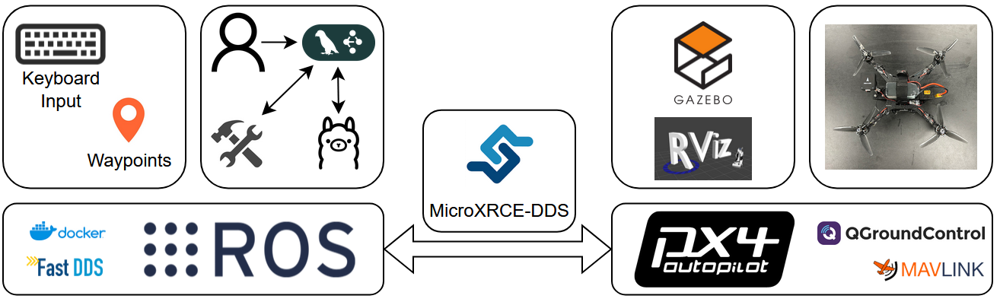
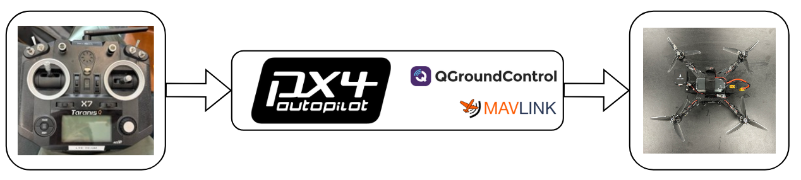
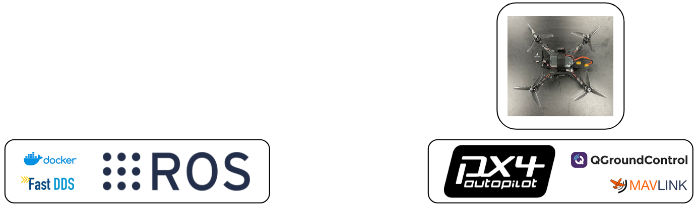
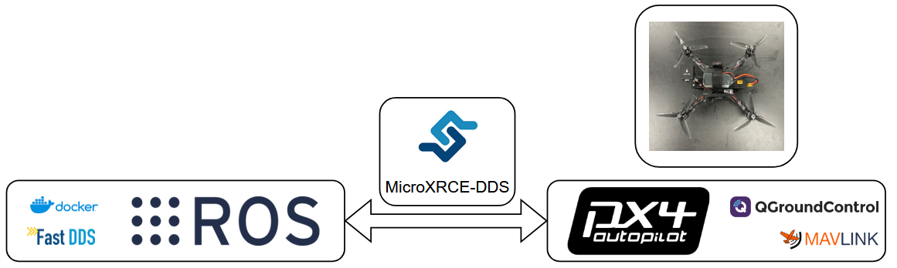
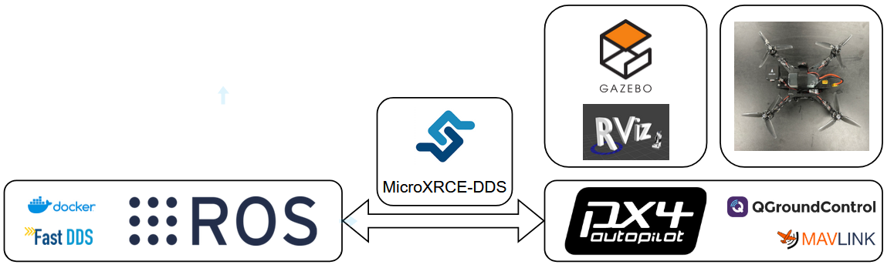
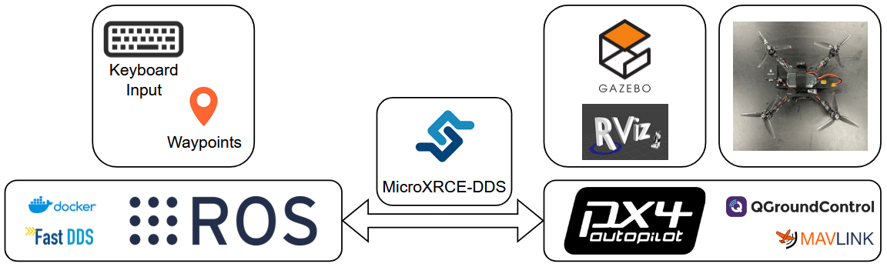

# Software Overview

## Full Set-up

/// caption
Layout of the whole software system
///

## Fitting in the Software

Follow along with the diagrams step by step to see how each piece builds upon the previous. This will allow for a natural, intuitive understanding if you are not familiar with many of the tools presented.

### Transmitter

/// caption
Connection between transmitter, PX4, and quadrotor
///

### ROS 2

/// caption
ROS 2 is an open-source framework designed to simplify the development of robotics software
///

### MicroXRCE-DDS

/// caption
MicroXRCE-DDS creates a communication bridge between ROS2 and PX4
///

### Gazebo

/// caption
Gazebo and RViz are used to simulate quadrotor flight
///

### Advanced Control

/// caption
ROS 2 provides framework to perform complex tasks and customize quadrotor control
///

### AI Agent

/// caption
An AI Agent can invoke LLMs and call tools to process natural language flight commands
///