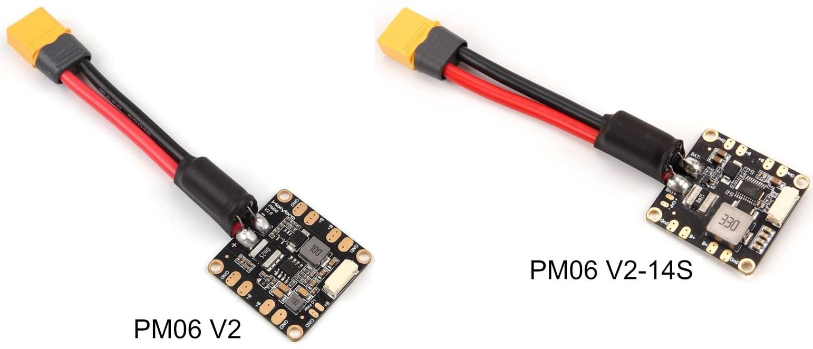

# Wiring Connections

## Power Module

=== "PM06"

    [Holybro Micro Power Module (PM06)](https://docs.px4.io/main/en/power_module/holybro_pm06_pixhawk4mini_power_module.html)

    Information for QGroundControl Power setting:

    - Voltage Divider: 18.182
    - Amperes per Volt: 36.364

    

    Solder the motors to the power module and connect a wire to power the flight controller.

## Flight Controller

=== "Pixhawk 6C Mini"

    Pixhawk 6C Mini Connections:

    | **Wire/Device** | **Pixhawk Port** |
    |:------------|:-------------|
    | Power module | Power |
    | Motors | 1, 2 ,3 4  (I/O PWM OUT [MAIN] in order)  |
    | Telemetry radio | TELEM1 |
    | Companion computer | TELEM2 |
    | Receiver | PPM/SBUS RC |
    | GPS | gps2 |

    Holybro port diagram: [Pixhawk 6C Mini Ports | Holybro](https://docs.holybro.com/autopilot/pixhawk-6c-mini/pixhawk-6c-mini-ports)

=== "Pixracer Pro"

    Pixracer Pro Connections:

    | **Wire/Device** | **PixracerPro Port** |
    |:------------|:-------------|
    | Power module | Power |
    | Motors | 1, 2 ,3 4  (I/O PWM OUT [MAIN] in order)  |
    | Telemetry radio | serial 1 (Telem 1)  |
    | Companion computer | serial 2 (Telem 2)  |
    | Receiver/Radio | rc_input  |
    | GPS | gps2 |

    Resources:

    * Ardupilot documentation: [Pixracer Pro - Plane documentation](https://ardupilot.org/plane/docs/common-pixracer-pro.html)
    * mRo documentation: [Pixracer Pro | User Guides](https://docs.mrobotics.io/autopilots/pixracer-pro.html)
    * This might help: [:simple-youtube: PixRacer - Software, Firmware and Connections](https://www.youtube.com/watch?v=-GlnAPqbIrY&list=PLYsWjANuAm4p0Kwj4SfTymFsU-lR-FSVq&index=3)

    
    /// caption
    Top view of PixracerPro (Notice the arrow points forward)
    ///

    
    /// caption
    Bottom view of PixracerPro
    ///

## Companion Computer

=== "Raspberry Pi"

    The Raspberry Pi needs 5V and 2A. It can't get this from the flight controller because although the voltage is 5V the current is not sufficient.

    Needs a seperate power supply directly from the battery. Use a UBEC to step down the voltage to power the RPi.